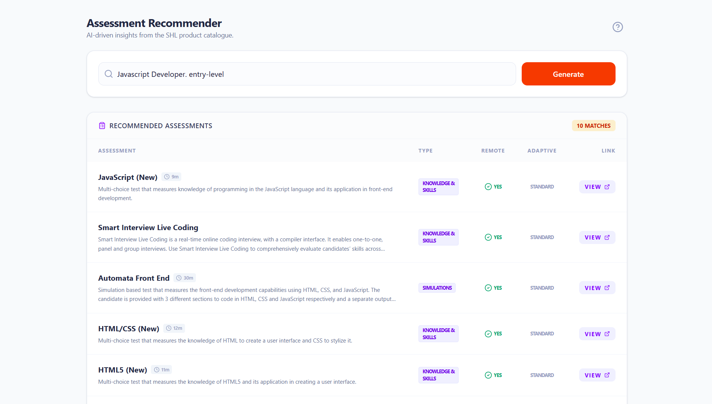

# Frontend for the Assessment Recommendation Engine for SHL catalogues.

# Project overview
An intelligent **Retrieval-Augmented Generation (RAG)** system that recommends relevant HR assessments from SHL's product catalog based on job descriptions and hiring requirements. The system uses web scraping to collect assessment data, vector embeddings for semantic search, and AI-powered ranking to provide personalized assessment recommendations.

Backend Repository: https://github.com/AshishW/Assesment-Recommendation-Engine
